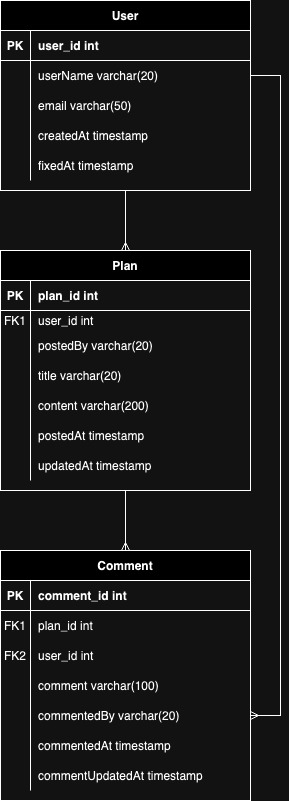

# API 명세서

| 기능       | Method | URI                           | RequestBody                                                                        | ResponseBody                                                                                                                                                               |
|----------|--------|-------------------------------|------------------------------------------------------------------------------------|----------------------------------------------------------------------------------------------------------------------------------------------------------------------------|
| 일정 등록    | POST   | /api/plans                    | { "postedBy": "String",  "title": "String",  "content": "String" } | { "id": "Long",  "postedBy": "String",  "title": "String",  "content": "String",  "postedAt": "LocalDateTime",  "updatedAt": "LocalDateTine" } |
| 일정 단건 조회 | GET    | /api/plans/{id}               | -                                                                                  | { "id": "Long",  "postedBy": "String",  "title": "String",  "content": "String",  "postedAt": "LocalDateTime",  "updatedAt": "LocalDateTine" } |
| 일정 수정    | PUT    | /api/plans/{id}               | { "title": "String",  "content": "String" }                            | { "id": "Long",  "postedBy": "String",  "title": "String",  "content": "String",  "postedAt": "LocalDateTime",  "updatedAt": "LocalDateTine" } |
| 일정 삭제    | DELETE | /api/plans/{id}               | -                                                                                  | -                                                                                                                                                                          |
| 댓글 작성    | POST   | /api/plans/{id}/comments      | { "comment": "String",  "commentedBy": "String" }                      | { "id": "Long",  "comment": "String",  "commentedBy": "String",  "commentedAt": "LocalDateTime",  "commentUpdatedAt": "LocalDateTine" }            |
| 댓글 단건 조회 | GET    | /api/plans/{id}/comments/{id} | -                                                                                  | { "id": "Long",  "comment": "String",  "commentedBy": "String",  "commentedAt": "LocalDateTime",  "commentUpdatedAt": "LocalDateTine" }            |
| 댓글 수정    | PUT    | /api/plans/{id}/comments/{id} | { "comment": "String" }                                                    | { "id": "Long",  "comment": "String",  "commentedBy": "String",  "commentedAt": "LocalDateTime",  "commentUpdatedAt": "LocalDateTine" }            |
| 댓글 삭제    | DELETE | /api/plans/{id}/comments/{id} | -                                                                                  | -                                                                                                                                                                          |
| 유저 등록    | POST   | /api/users                    | { "userName": "String",  "email": "String",  }                         | { "id": "Long",  "userName": "String",  "email": "String",  "createdAt": "LocalDateTime",  "fixedAt": "LocalDateTime" }                            |
| 유저 단건 조회 | GET    | /api/users/{id}               | -                                                                                  | { "id": "Long",  "userName": "String",  "email": "String",  "createdAt": "LocalDateTime",  "fixedAt": "LocalDateTime" }                            |
| 유저 전체 조회 | GET    | /api/users/                   | -                                                                                  | { "id": "Long",  "userName": "String",  "email": "String",  "createdAt": "LocalDateTime",  "fixedAt": "LocalDateTime" }                            |
| 유저 수정    | PUT    | /api/users/{id}               | { "userName": "String",  "email": "String",  }                         | { "id": "Long",  "userName": "String",  "email": "String",  "createdAt": "LocalDateTime",  "fixedAt": "LocalDateTime" }                            |
| 유저 삭제    | DELETE | /api/users/{id}               | -                                                                                  | -                                                                                                                                                                          |

 

